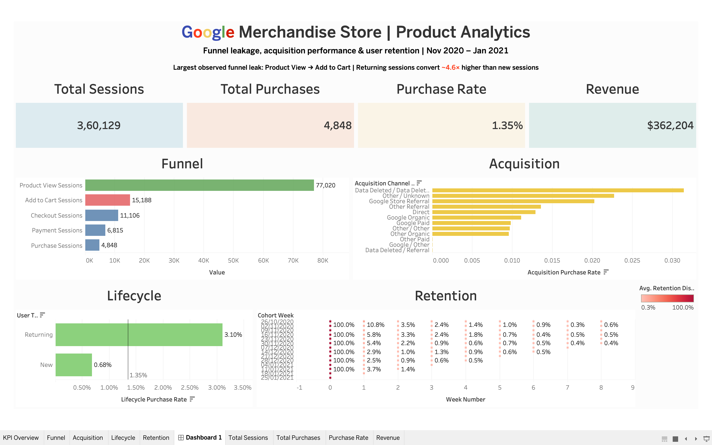

<div align="center">


<br>

<p>
  
  
  
  
</p>

<h3>From Funnel Leakage to Product Experimentation</h3>

<p>
  <i>
  An end-to-end product analytics case study investigating where users drop before purchase,
  which users actually convert, and what product intervention should be tested first.
  </i>
</p>

</div>

---

## 📊 Dashboard

<p align="center">
  
</p>
> **The dashboard summarizes the project's core product analytics findings across funnel performance, acquisition, lifecycle behavior, and retention.**

---

# 🎯 Business Problem

The Google Merchandise Store has millions of user interactions, but raw event data alone does not answer the questions a product team actually cares about.

This project was built around three stakeholder questions:

1. **Where do we lose users before purchase?**
2. **Which acquisition channels bring buyers, not just visitors?**
3. **Which product improvement should we test first?**

I extended the analysis with a fourth question:

> **Can we identify sessions that are more likely to purchase using only information available at the start of the session?**

The goal was therefore not simply to build a dashboard or train a model, but to connect:

**SQL → Product Analytics → Visualization → Experimentation → Machine Learning → Business Recommendation**

---

# 🔎 Key Findings

### 1. The largest observed funnel leak is Product View → Add to Cart

| Funnel Stage | Sessions |
|---|---:|
| Product View | 77,020 |
| Add to Cart | 15,188 |
| Checkout | 11,106 |
| Payment | 6,815 |
| Purchase | 4,848 |

The Product View → Add to Cart conversion rate was **19.72%**, making this the largest observed drop in the session funnel.

---

### 2. Returning users are dramatically more valuable

| User Type | Sessions | Purchases | Purchase Rate |
|---|---:|---:|---:|
| New | 261,238 | 1,780 | 0.68% |
| Returning | 98,891 | 3,068 | 3.10% |

Returning sessions represented only about **27% of sessions**, but generated approximately **63% of purchases**.

Their purchase rate was approximately **4.6× higher** than new sessions.

---

### 3. Acquisition volume does not equal conversion efficiency

Different acquisition source/medium groups showed materially different purchase rates.

This analysis was intentionally treated as **user-acquisition analysis**, because the GA4 `traffic_source` fields used here are acquisition-scoped rather than a perfect session-level attribution model.

---

### 4. A propensity model can concentrate high-intent sessions

An XGBoost model using only information available at session start achieved:

- **ROC-AUC:** 0.716
- **PR-AUC:** 0.031
- **Test purchase prevalence:** 1.12%

The most important business result was ranking performance:

| Segment | Purchase Rate |
|---|---:|
| All test sessions | 1.12% |
| Top 10% propensity sessions | **4.02%** |

**Top-decile lift: 3.60×**

The highest-propensity 10% of sessions captured approximately **35.96% of purchases** in the test period.

This does **not** mean the model causes purchases. It means the model can help concentrate attention on a higher-intent segment.

---

# 🧭 Analytical Approach

## 1. Data Audit

The project started with the public Google Merchandise Store GA4 sample dataset in BigQuery.

Dataset scope:

- **4.29M events**
- **270K users**
- **92 days of data**
- **360,129 analytical sessions**

Initial event audit included:

- Event distribution
- User counts
- Date coverage
- Purchase events
- GA4 event parameters

---

## 2. Event-Level Data Cleaning

GA4 stores many important attributes inside nested `event_params`.

I extracted and standardized fields including:

- `user_pseudo_id`
- `event_date`
- `event_timestamp`
- `event_name`
- `ga_session_id`
- `ga_session_number`
- `event_value`
- `transaction_id`
- `currency`
- Device
- Operating system
- Browser
- Country
- City
- Acquisition source
- Acquisition medium

---

## 3. Session-Level Data Model

The event-level data was transformed into a session-level analytical dataset.

**Grain:**

```text
user_pseudo_id + ga_session_id
```

Each session contains:

- Session timing
- Session number
- Event count
- Page views
- Product views
- Cart activity
- Funnel-stage flags
- Purchase flag
- Purchase revenue
- Device / OS / browser
- Geography
- Acquisition source / medium
- New vs Returning classification

This session-level dataset became the main analytical layer used throughout the project.

---

# 🛒 Funnel Analysis

The ecommerce journey was modeled as:

```text
Product View
      ↓
Add to Cart
      ↓
Checkout
      ↓
Shipping
      ↓
Payment
      ↓
Purchase
```

Key session-level conversion rates:

| Transition | Conversion |
|---|---:|
| Product View → Add to Cart | **19.72%** |
| Add to Cart → Checkout | **73.12%** |
| Checkout → Shipping | **99.99%** |
| Shipping → Payment | **61.37%** |
| Payment → Purchase | **71.14%** |
| Overall Session Purchase Rate | **1.35%** |

Device-level analysis showed broadly similar behavior across desktop, mobile, and tablet.

Therefore, mobile was **not** incorrectly selected as the primary problem simply because it is a common ecommerce assumption.

---

# 📈 Acquisition Analysis

Acquisition performance was evaluated across source/medium combinations such as:

- Google Organic
- Google Paid
- Direct
- Google Merchandise Store Referral
- Other Referral
- Other Organic
- Other / Other
- Data Deleted categories

The analysis compared both:

- Session volume
- Purchase rate

This prevents the common mistake of assuming that the channel with the most traffic is automatically the best-performing channel.

---

# 🔄 Lifecycle & Retention

Users were classified as:

- **New**
- **Returning**

Weekly retention cohorts were then created based on each user's first observed week.

The analysis accounted for **right-censoring**: later cohorts do not have enough observation time to calculate later retention periods, so missing future cohort weeks were not interpreted as zero retention.

This provided a clearer view of how users returned over time.

---

# 🧪 Experimentation

The analytics identified two connected signals:

- Product View → Add to Cart is the largest observed funnel leak.
- Returning users convert substantially better than new users.

This led to the following product hypothesis:

> **Improving first-session product discovery could increase engagement and encourage users to return.**

### Proposed Experiment

**Population:** New users

**Control:** Current product discovery experience

**Treatment:** Improved product recommendations, category navigation, and clearer calls-to-action

### Primary Metric

**7-day retention**

### Secondary Metrics

- Product View → Add to Cart
- Purchase conversion
- Engagement

### Guardrails

- Revenue per session
- Purchase rate
- User experience / engagement quality

---

# 📐 Statistical Planning

A separate experimentation notebook calculates the required sample size programmatically.

Planning assumptions:

- Baseline 7-day retention: **5.5%**
- Minimum detectable effect: **20% relative**
- Target retention: **6.6%**
- Significance level: **α = 0.05**
- Statistical power: **80%**

Approximate requirement:

**~7,360 users per group**

**~14,720 users total**

A simulated A/B-test example is included to demonstrate statistical interpretation.

The simulated experiment is clearly separated from historical business results.

---

# 🤖 Purchase Propensity Modeling

The project then adds a Data Science layer.

### Business Question

> Can we identify sessions that are more likely to purchase using only information available at the start of the session?

### Prediction Unit

**Session**

### Target

```text
purchased = 1 / 0
```

### Prediction Moment

**Session start**

---

## 🚫 Leakage Prevention

A major focus was preventing the model from seeing information that would only become available after the prediction point.

The model therefore excluded downstream session outcomes such as:

- Add to cart
- Checkout
- Payment
- Purchase
- Revenue
- Session duration
- Page views
- Product views
- Other post-start behavioral outcomes

Candidate features included:

- Session number
- Day of week
- Month
- Weekend indicator
- Device
- Operating system
- Browser
- Country
- Acquisition source
- Acquisition medium

---

# 📊 Model Performance

Two models were evaluated using a **time-based train/test split**, with the final 21 days held out as the test period.

| Model | ROC-AUC | PR-AUC |
|---|---:|---:|
| Logistic Regression | 0.689 | 0.029 |
| XGBoost | **0.716** | **0.031** |

The test purchase prevalence was only **1.12%**.

Because this is a rare-event problem, accuracy and a default 0.5 classification threshold are not the main focus.

Instead, the model is evaluated primarily as a **ranking system**.

### Top-Decile Analysis

The top 10% of predicted sessions had:

**4.02% purchase rate**

versus:

**1.12% overall purchase rate**

Result:

### **3.60× Lift**

The top 10% also captured approximately **35.96% of purchases** in the test period.

---

# 💡 Business Recommendation

The final recommendation combines the descriptive analytics and predictive layer:

### 1. Fix the first-session discovery problem

The largest observed funnel leak occurs between product viewing and adding to cart.

### 2. Prioritize new users

New sessions convert at only **0.68%**, compared with **3.10%** for returning sessions.

### 3. Use propensity scoring for prioritization

The model can identify a concentrated high-intent segment, with the top 10% converting at **3.60× the overall test rate**.

### 4. Validate the product change experimentally

The model identifies **WHO** is more likely to purchase.

The experiment determines **WHETHER** the product intervention actually improves behavior.

```text
Analytics
    ↓
Identify Funnel Problem
    ↓
Identify High-Value Audience
    ↓
Target Intervention
    ↓
Randomized Experiment
    ↓
Measure Causal Impact
```

---

# 🧠 What This Project Demonstrates

This project combines several skills into one business workflow:

| Area | Skills Demonstrated |
|---|---|
| **SQL** | BigQuery, CTEs, UNNEST, sessionization, aggregation |
| **Product Analytics** | Funnels, acquisition, lifecycle, retention |
| **Visualization** | Tableau dashboards, KPI design, cohort heatmaps |
| **Statistics** | Hypothesis testing, effect size, power, sample size |
| **Experimentation** | A/B test design, metrics, guardrails |
| **Machine Learning** | Logistic Regression, XGBoost, classification |
| **ML Evaluation** | ROC-AUC, PR-AUC, lift, top-decile analysis |
| **ML Engineering** | Pipelines, preprocessing, time-based validation |
| **Business Thinking** | Problem diagnosis → prioritization → experimentation |

---

# 📂 Project Structure

```text
ga4-bigquery-product-analytics/
│
├── notebooks/
│   ├── 01_experiment_design_and_statistics.ipynb
│   ├── 02_purchase_propensity.ipynb
│   └── 03_model_business_impact.ipynb
│
├── sql/
│   ├── 01_data_audit.sql
│   ├── 02_clean_events.sql
│   ├── 03_session_metrics.sql
│   ├── 04_funnel_analysis.sql
│   ├── 05_acquisition_analysis.sql
│   ├── 06_lifecycle_analysis.sql
│   └── 07_conversion_diagnosis.sql
│
├── Dashboard.png
├── RetentionFunnel.twb
├── Weekly Cohorts.csv
├── BigQuerySQLAnalysis.csv
├── .gitignore
└── README.md
```

---

# 🛠️ Technology Stack

| Component | Technology | Purpose |
|---|---|---|
| **Data Warehouse** | Google BigQuery | GA4 event analysis |
| **SQL** | Standard SQL | Data cleaning, sessionization & analytics |
| **Python** | Python | Statistical analysis & ML |
| **Pandas** | Pandas | Data preparation |
| **Scikit-learn** | Scikit-learn | Preprocessing & Logistic Regression |
| **XGBoost** | XGBoost | Purchase propensity modeling |
| **Statistics** | Statsmodels / Python | Experiment & sample-size planning |
| **Visualization** | Tableau | Stakeholder dashboard |
| **Version Control** | Git / GitHub | Project organization |

---

# 📓 Notebook Guide

### `01_experiment_design_and_statistics.ipynb`

Covers:

- Baseline funnel metrics
- New vs Returning conversion
- Retention baseline
- Statistical reasoning
- A/B test design
- Sample-size calculation
- Simulated experiment interpretation

### `02_purchase_propensity.ipynb`

Covers:

- Leakage-safe feature definition
- Time-based train/test split
- Logistic Regression baseline
- XGBoost
- ROC-AUC / PR-AUC
- Top-decile lift
- Feature importance

### `03_model_business_impact.ipynb`

Connects the model to the product decision:

- High-propensity segment
- Business impact
- Targeting strategy
- Experiment design
- Causal limitations
- Final recommendation

---

# 🗃️ SQL Guide

The SQL workflow is organized into seven files:

```text
01_data_audit
      ↓
02_clean_events
      ↓
03_session_metrics
      ↓
04_funnel_analysis
      ↓
05_acquisition_analysis
      ↓
06_lifecycle_analysis
      ↓
07_conversion_diagnosis
```

This mirrors the analytical progression from raw GA4 events to business diagnosis.

---

# ⚠️ Limitations

This project uses the **Google Merchandise Store GA4 public sample dataset**, which is an obfuscated public dataset.

Therefore:

- Findings should be interpreted directionally.
- The dataset covers a limited three-month period.
- Acquisition fields are not treated as perfect session-level attribution.
- Retention for later cohorts is naturally limited by the observation window.
- The propensity model is predictive, not causal.
- The 3.60× lift represents observational ranking performance, not an expected causal increase from an intervention.
- The proposed product intervention requires randomized experimentation before being adopted.

---

# 🚀 Reproducibility

The SQL analysis was developed in **Google BigQuery** using the public GA4 ecommerce sample dataset.

The notebooks contain the statistical, experimentation, and machine-learning analysis.

The Tableau workbook contains the stakeholder-facing dashboard.

The repository intentionally does not include private credentials or BigQuery authentication files.

---

# 👤 Author

<div align="left">


<strong>Syed Abdul Waheed</strong><br/>
<em>Data Analyst | Product Analytics | Data Science</em>

<br/><br/>

I enjoy turning raw data into clear business decisions — from SQL analysis and dashboards to experimentation and predictive modeling.

<br/><br/>

<a href="https://www.linkedin.com/in/syed-abdul-waheed/">
  
</a>
<a href="https://github.com/Syed-Waheed">
  
</a>

</div>

<br clear="left"/>

---

<div align="center">

### ⭐ If you found this project useful, consider starring the repository.

</div>
